# Criando uma aplicação com o Keil C51

O *nRFgo Software Development Kit (SDK)* usado com o Keil C51 possibilita um modo flexível e simples para desenvolver usando um dispositivo nRF. Através desse guia você adquirir o conhecimento básico sobre como criar uma aplicação.

* Desenvolvimento usando nRFgo SDK
* Configurando o compilador Keil
* Iniciando com sua primeira aplicação

Baseado em  [[1]](http://www.nordicsemi.com/eng/nordic/download_resource/10885/7/38349113/1515).

## Pre-requisitos para este tutorial

**Software**
* Keil C51.
* nRFgo SDK.

**Hardware**
* nRF24LE1 e uma placa para conexão com a protoboard.
* Um gravador para o nRF24LE1.
* Alimentação de 3.3V.
* Led e resistor.

## Organização do nRFgo SDK
Este SDK é organizado em forma de árvore. Aqui uma pequena descrição das pastas mais importantes:

* \\Docs

Aqui fica a documentation do SDK.

* \\Precompiled files

Nesta pasta estão HEX files de projetos de exemplo. Não usaremos eles neste tutorial.

* \\Source code\\gazell

Gazell é uma biblioteca de link e pareamento para aplicações wireless. Não usaremos eles neste tutorial.

* **\\Source code\\hal**

É a abreviação para **Hardware Abstraction Layer (HAL)** contém as funções de interface gerais para começar a desenvolver rapidamente com os módulos que contém algum chip nRF. Usaremos algumas ou todos esses arquivos na maioria dos projetos. O caminho (*path*) destes arquivos precisa ser adicionado no seu projeto.

* **\\Source code\\lib**

As biblitoecas de interface com o HAL para funcionalidades mais específicas. Um exemplo disso é a funcionalidade a biblitoeca test RF que pode ser usada para configurar diferentes modos de teste.

* **\\Source code\\projects**

Uma pasta de projetos contendo exemplos que usam o SDK. O fabricante sugere que você salve seus projetos nesta pasta.

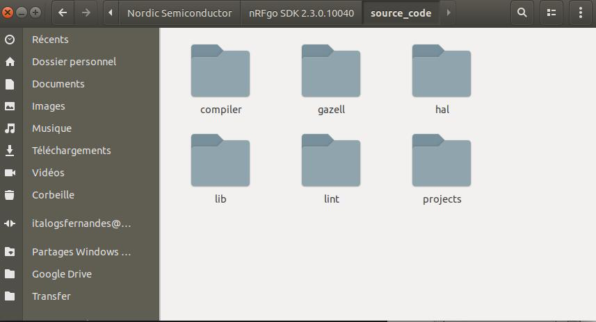

## Desenvolvendo com o nRFgo SDK

É possível dividir o processo de desenvolvimento com o nRFgo SDK em 4 passos. Esses passos, listados abaixo, vão desde a configuração do Keil até testar seu projeto.

1. Configurar seu projeto no Keil.
2. Escrever sua aplicação.
3. Inclusão de arquivos.
4. Testar seus projeto.

### Passo 1: Configurando seu projeto no Keil

Antes de escrever qualquer linha de código você precisa criar um novo projeto no qual você configurará o Keil para usar a dispositivo nRF que você possui (nRF24LE1) e incluir os caminhos para as biblitoecas que utilizará.

1. Inicie o Keil uVision através do menu do programas do Windows.
2. Logo após, selecione **Project, New uVision Project** no menu do Keil.
3. Selecione onde você deseja salvar seu novo projeto. Criarei uma pasta chamada "my_first_project" por exemplo.
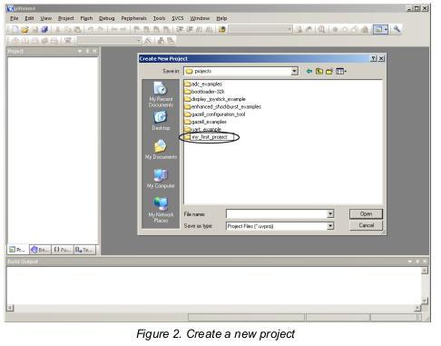
4. Crie a pasta e selecione **Save**.
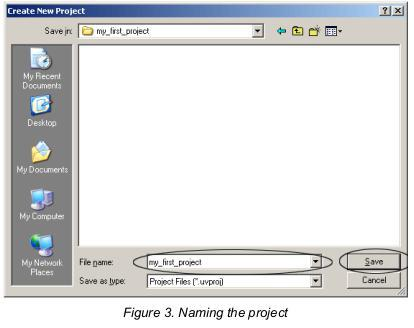
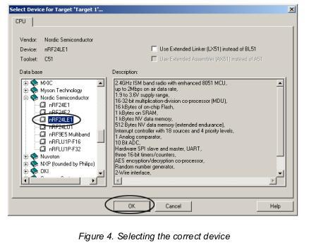
5. **Escolha do dispositivo**. No nosso projeto será o nRF24LE1. Se você está usando a versão completa do Keil você pode também utilizar a opção *Use Extended Linker/Assembler*. Entretanto para esse projeto não será necessário, está opção não é habilidade para a versão de avaliação do Keil.
6. Selecione *Ok*.
7. Selecione *No* quando perguntado para copiar o arquivo **Startdant 8051 Startup Code**. (Ele pode ser adicionado mais tarde, caso necessário)

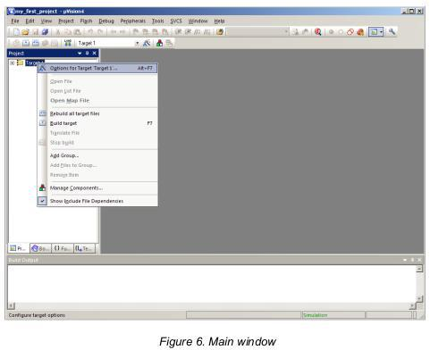
8. É preciso configurar o projeto antes de incluir arquivos e escrever seu código. Dê um clique com o botão direito em "*Target 1*" no área *Project tree view* e selecione **Options for Target** no menu que surgirá.
9. A figura 7 mostra uma captura de tela da aba "*Output*".

10. Marque a opção **Create HEX File**, para posteriormente gravar (*program*) o arquivo HEX gerado no seu dispositivo.
11. O proxímo passo é selecionar a aba "*C51*" e inicluir algumas pastas que serão utilizadas para encontrar os arquivos importados pelo seu código.
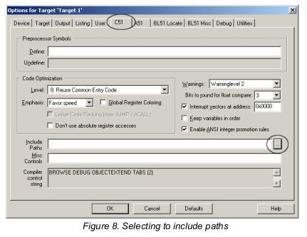
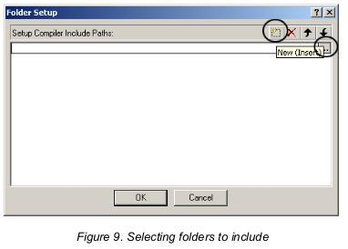
12. Por padrão nenhum caminho está incluido, então é necessário incluir 4 caminhos no projeto, utilizando a janela "*Folder setup*" (Figura 9).
13. Use os botões de inclusão para incluir todos os caminhos mostrados na Figura 10.
O caminho depende da versão do SDK, no meu caso :
    * c:\\Nordic Semiconductor\\nRFgo SDK 2.3.0.10040\\source_code\\hal
    * c:\\Nordic Semiconductor\\nRFgo SDK 2.3.0.10040\\source_code\\hal\\nrf24lu1p
    * c:\\Nordic Semiconductor\\nRFgo SDK 2.3.0.10040\\source_code\\hal\\nrf24le1
    * c:\\Nordic Semiconductor\\nRFgo SDK 2.3.0.10040\\source_code\\compiler\\common
14. A figura 10 mostra os caminhos que contém os arquivos necessários para este projeto.
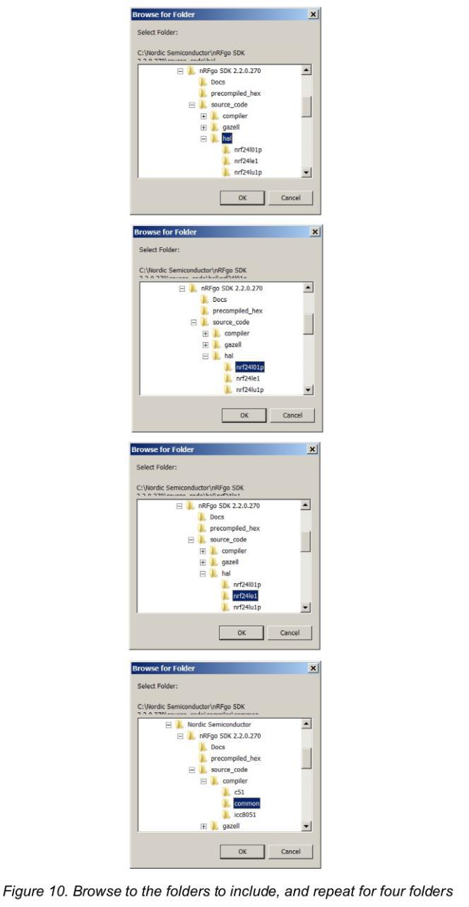
15. Após selecionar as pastas desejadas, confirme sua escolha selecionando **OK** na janela "*Browse for folder*".
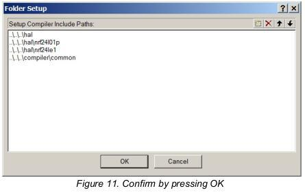
16. As pastas agora incluidas contêm todo os arquivos HAL que você usará para programar os modulos internos ao nRF24LE1. Se você está desenvolvendo com outro dispositivo, você precisará incluir os arquivos específicos para cada dispositivo. Todos dispositivos suportados pelo HAL tem suas próprias pastas. Selecione **OK** na janela "*Folder setup*" como mostrado na figura 11.
17. A figura 12 mostra o print da tela neste momento.
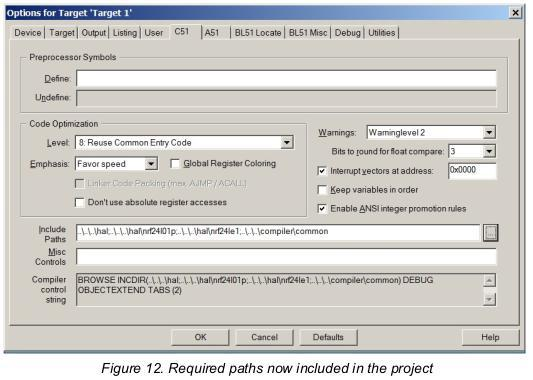
18. Se você estiver utilizando a opção "*extended Linker*" você pode escrever 'REMOVEUNUSED' no campo "*Misc controls*". Isso vai reduzir o espaço do codígo  removendo as funções não usadas durante a compilação. O nosso dispositivo tem uma memória bem pequena, portanto é importante estar atento a ao uso dela.
19. Quando você compila um projeto com funções que não foram usadas, uma mensagem de *warning* realacionada aparece. Ela não impedirá seu código de rodar mas é polui bastante a saída quando você compila algo, podendo atrapalhar o reconhecimento de erros. Para desabilitar esse *warning* você pode escrever '15, 16' no campo "*Disable warning numbers*". Veja a área circulada na figura 13.
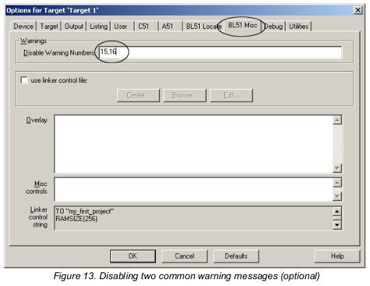
20. Clique no botão **OK** para confirmar as configurações do Keil.

Você completou o passo 1 do tutorial, agora o projeto está pronto para que você escreva seu primeiro código.

### Passo 2: Seu primeiro programa

O projeto agora está configurado e você pode começar a escrever as primeiras linhas do seu código para compilar e gravar este programa no nRF24LE1.

1. Antes de começar a escrever seu código você deve criar um arquivo vazio, vamos chamar de **main.c** e criar na pasta do projeto.
2. Na área *Project tree view*, clique com o botão direito sobre a pasta o grupo em que colocará seu arquivo e no menu selecione **Add files to group "application"**... como mostrado na figura 18. A janela "Add files to group 'application'" aparecerá.
3. Figura 18 e 19.
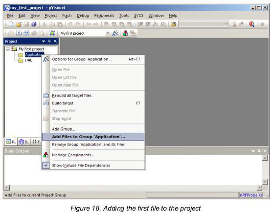
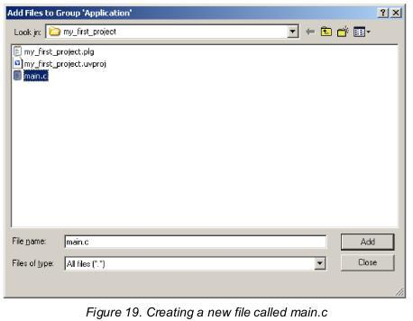
4. Crie um arquivo de texto clicando comm o botão direito na pasta *view* e escolhendo **New text document**, renomei-o para **main.c**. Veja a figura 19. Esse arquivo vai funcionar como um ponto de entrada para sua aplicação.
5. Clique duas vezes no arquivo main.c na área *Project tree view* para editá-lo.

6. Adicione o arquivo vazio main.c para o projeto, escreva algumas linhas de código e compile-o.
7. Você pode copiar o código de exemplo abaixo.
```c++
/* My first application */

#include<Nordic\reg24le1.h>

// Main routine
void main(){
    // Set P0 as Output
    P0DIR = 0x00;
    while(1){
        // Toggle a GPIO
        P00 = !P00;
    }
}
```
8. Este código de exemplo vai inverter o *Port 0 pin 0* continuamente.
9. Após escrever o código de exemplo no arquivo main.c você pode compilar o programa selecionando **Rebuild**. Veja a figura 22.
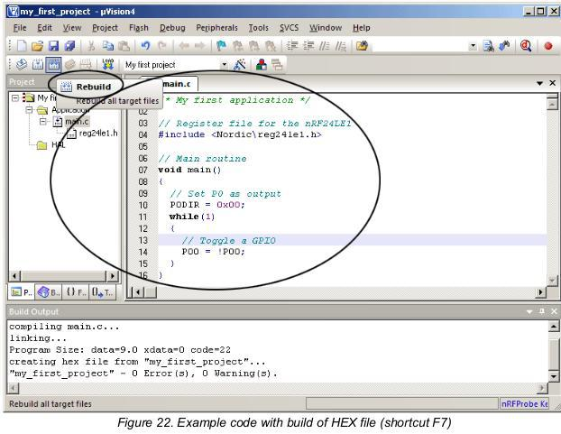
10. Após compilar o código você poderá gravá-lo no módulo nRF24LE1. Se você estiver utilizando o kit vendido pela nordik veja nas referências deste documento como fazer isso, caso esteja utilizando um módulo sozinho o processo de gravação de um código será abordado em outro artigo.

Neste ponto, você concluiu o passo 2 e criou com sucesso o seu arquivo HEX. Este arquivo contém as informações em linguagem de máquina que dizem todas as instruções que você programou.

## Referências

1. Creating Applications with the Keil C51 C Compiler - [Acessar](http://www.nordicsemi.com/eng/nordic/download_resource/10885/7/38349113/1515). (Eu basicamente traduzi esse documento e selecionei as partes que são importantes e quais não são úteis para o nosso caso.)

[home](./)
